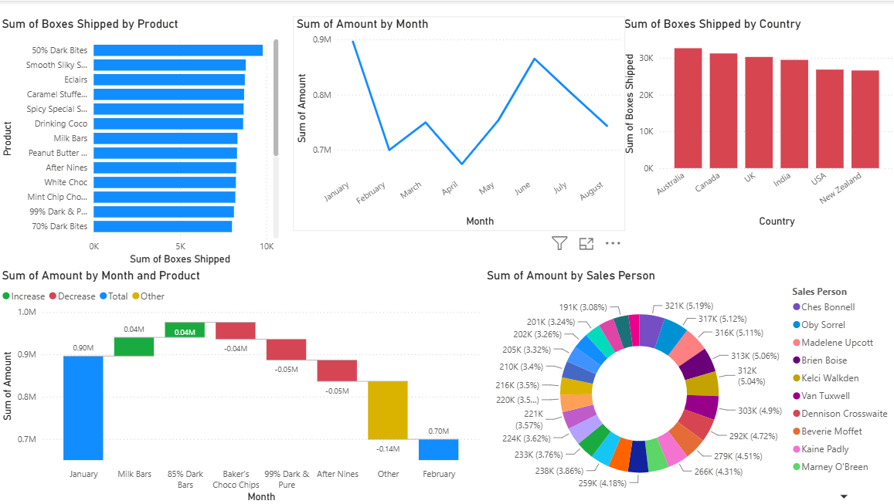

# Chocolates-Sales-Distribution-Analysis

# Global Confectionery Sales & Distribution Analysis

An interactive Power BI dashboard tracking international retail distribution logistics, seasonal revenue trends, and sales team performance.

## Dashboard Preview

## Project Components & Tech Stack
* **BI Platform:** Power BI Desktop
* **Dataset File:** `sample-data.xlsx`
* **Core Visuals Used:** Line Timelines, Horizontal/Vertical Distribution Bars, Waterfall Variance Bridges, and Donut Revenue Splits.

---

## Core Business Insights Unlocked

* **Seasonal Revenue Swings:** Total monthly sales peak in January near ₹0.9M, hit an annual low point in April near ₹0.6M, and experience a massive mid-year recovery back to over ₹0.85M by June.
* **Product-Driven Revenue Changes:** The Waterfall analysis proves that while core catalog items like `Milk Bars` and `85% Dark Bars` achieved positive value growth (+0.04M each), a heavy collapse in minor specialty lines (grouped as `Other` at -0.14M) pulled down overall performance from January to February.
* **Geographic Logistics:** Australia takes the lead in total supply chain operations with over 30K individual boxes shipped, showing strong global market balancing alongside Canada and the UK.
* **Sales Team Contribution:** Individual financial tracking via the revenue breakdown shows clear top-tier drivers, led by Ches Bonnell contributing ₹321K (5.19% of net revenue).
